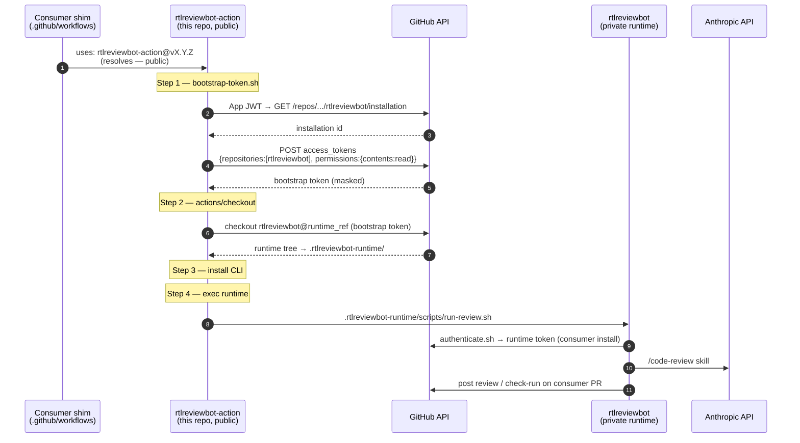

# Architecture — rtlreviewbot-action

This repo is the **public entry point** for [rtlreviewbot](https://github.com/Ride-The-Lightning/rtlreviewbot). It carries no review logic. Its only job is to make the bot **resolvable from any consumer repo** — including public ones — and then hand off to the private runtime unchanged.

If you want to understand what the bot *does* (commands, review flow, skill), read [rtlreviewbot's architecture doc](https://github.com/Ride-The-Lightning/rtlreviewbot/blob/main/docs/architecture.md). This doc explains only the thin resolve-and-fetch layer that lives here.

## The problem this layer solves

A consumer's workflow `uses:` a GitHub action by repo path. GitHub resolves that path with the consumer job's token **before** any step runs. For a *private* action repo, that resolution succeeds only when the org's Actions-access setting (`none` / `organization` / `enterprise`) covers the consumer — and none of those settings ever extend a private repo's actions to a **public** consumer. So a public consumer fails at setup:

```
##[error]Unable to resolve action `Ride-The-Lightning/rtlreviewbot`, not found
```

There is no per-repo allowlist to work around this. The fix is to put the *entry point* in a **public** repo (this one), which every consumer can resolve, and have it fetch the private runtime at run time using credentials the consumer already supplies. See [rtlreviewbot#17](https://github.com/Ride-The-Lightning/rtlreviewbot/issues/17) for the full design discussion.

## Two tokens, two installations

The single idea that makes this work is that **two different installation tokens** are minted during a run, with different scopes and purposes:

| Token | Minted by | Installation | Scope | Used for |
|-------|-----------|--------------|-------|----------|
| **bootstrap** | `bootstrap-token.sh` (this repo) | the `rtlreviewbot` repo's own install | `contents:read` on **`rtlreviewbot` only** | checking out the private runtime |
| **runtime** | `scripts/authenticate.sh` (private runtime) | the **consumer's** install (`installation_id` input) | full review perms (checks/issues/pulls write) | posting the review on the consumer PR |

The consumer's `installation_id` token cannot read `rtlreviewbot` — it is scoped to the consumer's own repos. That is exactly why the bootstrap token exists. It is the App's own token, minted from the same `app_id` / `private_key` the consumer already passes, but deliberately narrowed to read-only access to one repo.

`bootstrap-token.sh` also **discovers** the rtlreviewbot installation (`GET /repos/Ride-The-Lightning/rtlreviewbot/installation`, authed with the App JWT) rather than hardcoding the org installation id.

## Run sequence



The four composite steps in [`action.yml`](../action.yml):

1. **Mint bootstrap token** — `bootstrap-token.sh` produces a least-privilege, repo-scoped `contents:read` token and masks it in the log.
2. **Check out private runtime** — `actions/checkout` pulls `Ride-The-Lightning/rtlreviewbot@runtime_ref` into `.rtlreviewbot-runtime/` using that token (`persist-credentials: false`, so the token is not left in git config).
3. **Install Claude Code CLI** — `npm install -g @anthropic-ai/claude-code`.
4. **Run the runtime** — exec `.rtlreviewbot-runtime/scripts/run-review.sh` with the same env/args the legacy in-repo action used.

## Why the runtime needs no changes

Step 4 hands off to `run-review.sh` exactly as the legacy `.github/actions/review` did. This works from the new checkout path because **the runtime resolves every path from its own location, never from the working directory**:

- `run-review.sh` sets `SCRIPT_DIR="$(cd "$(dirname "${BASH_SOURCE[0]}")" && pwd)"` and finds all siblings (`authenticate.sh`, handlers, …) relative to it.
- `handle-review.sh` derives `REPO_ROOT` the same way and reads the skill from `$REPO_ROOT/skills/code-review` as files, composing them into the prompt — it does **not** rely on the CLI discovering a skill via the working directory.
- The context dir handed to Claude (`--add-dir`) is an absolute `mktemp -d`.

In both the legacy and current layouts the run step's working directory is `GITHUB_WORKSPACE` while the runtime tree lives at a *different* absolute path. Only that absolute path changed (`$GITHUB_ACTION_PATH/../../..` → `$GITHUB_WORKSPACE/.rtlreviewbot-runtime`), and it is computed dynamically — so the change is transparent to the runtime.

## Versioning

Two version axes, pinned in lockstep. `rtlreviewbot-action@vX.Y.Z` defaults its `runtime_ref` input to the runtime's `vX.Y.Z`, so pinning a consumer to one tag pins both the entry point and the runtime it fetches. `runtime_ref` stays overridable for testing an unreleased runtime ref (e.g. a branch) before a tag is cut.

## Trust boundary

- The action executes private code fetched at run time using App credentials the consumer **already supplies and already runs today** via the legacy private action — no new code-execution exposure.
- The bootstrap token is the App's own, minted from those same credentials (the consumer could already mint it), scoped to `contents:read` on a single repo, and masked.
- The only new public surface is `action.yml` + `bootstrap-token.sh`. Both are kept logic-free (mint + checkout only); all review logic stays in the private runtime.

## Prerequisites

- The rtlreviewbot App must have `contents:read` on the `rtlreviewbot` repo (the repo must be in the App installation's selection). *Confirmed: the Ride-The-Lightning installation is set to all-repositories with `contents:read`.*
- The App must be installed on the consumer repo so its `installation_id` exists and the runtime token can post.
